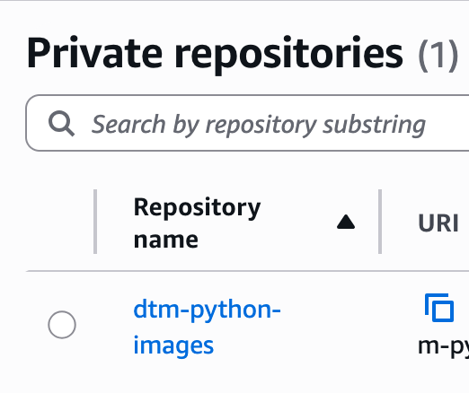
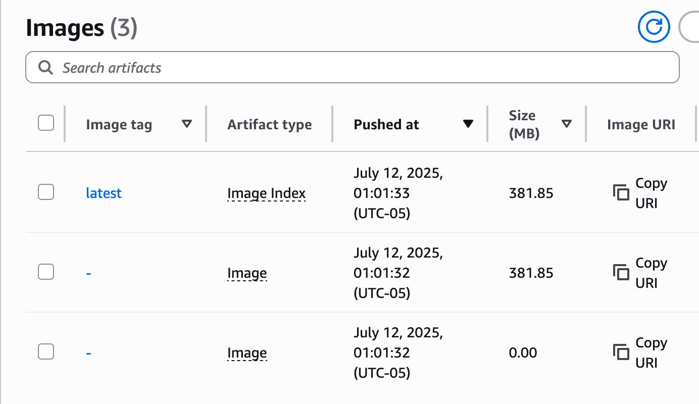
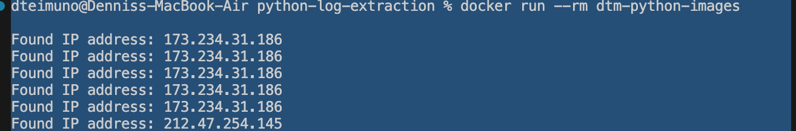

````markdown
#  Python Log Parser +  Docker +  AWS ECR Project

##  Project Summary

This project builds a Python tool to extract and summarize IP addresses from a raw SSH log file (`openssh.log`). The project is containerized using Docker and pushed to AWS Elastic Container Registry (ECR) for potential deployment in cloud environments.

---

##  Project Files

### `log-parsing.py`
- Reads `openssh.log` line by line.
- Uses a regex pattern to extract valid IPv4 addresses (`0.0.0.0` to `255.255.255.255`).
- Tracks frequency using `collections.Counter`.
- Prints all found IPs and a summary report of:
  - Total IP matches
  - Unique IPs
  - Top 10 most frequent IPs

### `openssh.log`
- Sample real-world SSHD log containing multiple suspicious login attempts.
- Provides a rich test bed for log parsing and IP extraction.
- Includes IPs such as:
  - `173.234.31.186`
  - `52.80.34.196`
  - `112.95.230.3`
  - ...and many more.

### `Dockerfile`
- Base image: `python:3`
- Copies the log parser script and log file into the container.
- Sets up the container to execute the script on start.
```

```dockerfile
FROM python:3
WORKDIR /usr/src/app
COPY log-parsing.py .
COPY openssh.log .
CMD ["python", "log-parsing.py"]
````

### `ecr-create.py`


* Uses `boto3` to create a private ECR repository (`dtm-python-images`).
* Ensures image tags are mutable.
* Encrypts images using `AES256`.
```

```python
import boto3
client = boto3.client('ecr')
response = client.create_repository(
    repositoryName='dtm-python-images',
    imageTagMutability='MUTABLE',
    encryptionConfiguration={'encryptionType': 'AES256'}
)
```

### `docker.sh`


Shell script that:

* Builds the Docker image.
* Authenticates Docker to AWS ECR using `aws ecr get-login-password`.
* Tags the image with the ECR repository URI.
* Pushes the image to AWS ECR.

```bash
#!/bin/bash
ACCOUNT_ID=<place-yours-here>
REGION=us-east-1
REPO_NAME=dtm-python-images

docker build -t $REPO_NAME .
aws ecr get-login-password --region $REGION | \
  docker login --username AWS --password-stdin $ACCOUNT_ID.dkr.ecr.$REGION.amazonaws.com
docker tag $REPO_NAME:latest $ACCOUNT_ID.dkr.ecr.$REGION.amazonaws.com/$REPO_NAME:latest
docker push $ACCOUNT_ID.dkr.ecr.$REGION.amazonaws.com/$REPO_NAME:latest
```

---

## 🔍 Output Example

When run, the script prints:

```text
Found IP address: 173.234.31.186
Found IP address: 52.80.34.196
...

Summary Stats:
Total IP matches found: 100+
Unique IPs found: 35
Top 10 Most Frequent IPs:
112.95.230.3: 40 times
173.234.31.186: 10 times
...
```

To test that the containerized tool worked, I used the command:

```
docker run --rm dtm-python-images
```


---

##  Skills Practiced

* Python scripting (regex, file handling, data structures)
* Log analysis
* Docker containerization
* AWS ECR automation (boto3 + shell scripting)
* Infrastructure automation best practices

---

